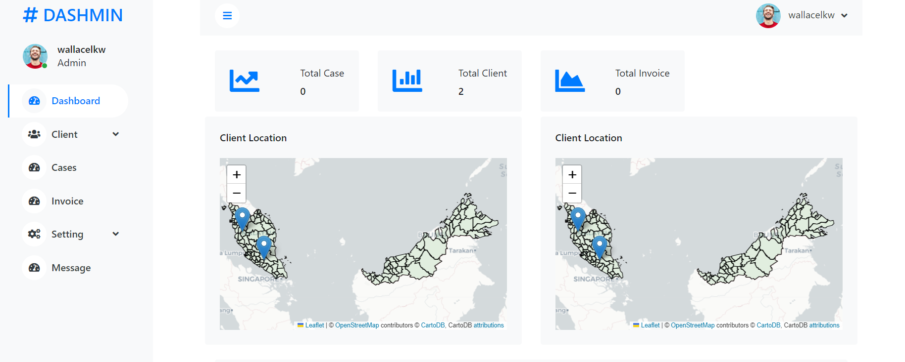

## Overview
Legal CRM System in Malaysia is help the new law firm handle the client relationship and cases. Besides it also provide the basic analysis of the client and case. The system include create client,
cases, invoice.

## Step
1. Clone the git
   `git clone [repo]`
2. Create virtual environment
   `python -m venv env`
3. Install the dependencis
   `pip install -r requirements.txt`
4. Make migrations
   `python manage.py makemigrations`
5. Migrate to database
  `python manage.py migrate`
6. Run the program
   `python manage.py runserver`

**This is only use db.sqlite**. If want use PostgreSQL it need to link the database under `settings.py`

DATABASES = { 
&emsp;&emsp;&emsp;&emsp;"default": { 
&emsp;&emsp;&emsp;&emsp;&emsp;&emsp;&emsp;"ENGINE": "django.db.backends.postgresql_psycopg2",  
&emsp;&emsp;&emsp;&emsp;&emsp;&emsp;&emsp;"NAME": env("DB_NAME"),  
&emsp;&emsp;&emsp;&emsp;&emsp;&emsp;&emsp;"USER": env("DB_USER"),  
&emsp;&emsp;&emsp;&emsp;&emsp;&emsp;&emsp;"PASSWORD": env("DB_PASSWORD"),  
&emsp;&emsp;&emsp;&emsp;&emsp;&emsp;&emsp;"HOST": env("DB_HOST"),  
&emsp;&emsp;&emsp;&emsp;&emsp;&emsp;&emsp;"PORT": env("DB_PORT"),  
&emsp;&emsp;&emsp;&emsp;&emsp;&emsp;&emsp;&emsp;}  
&emsp;&emsp;&emsp;&emsp;&emsp;&emsp;}  

## Screeshot of the System

